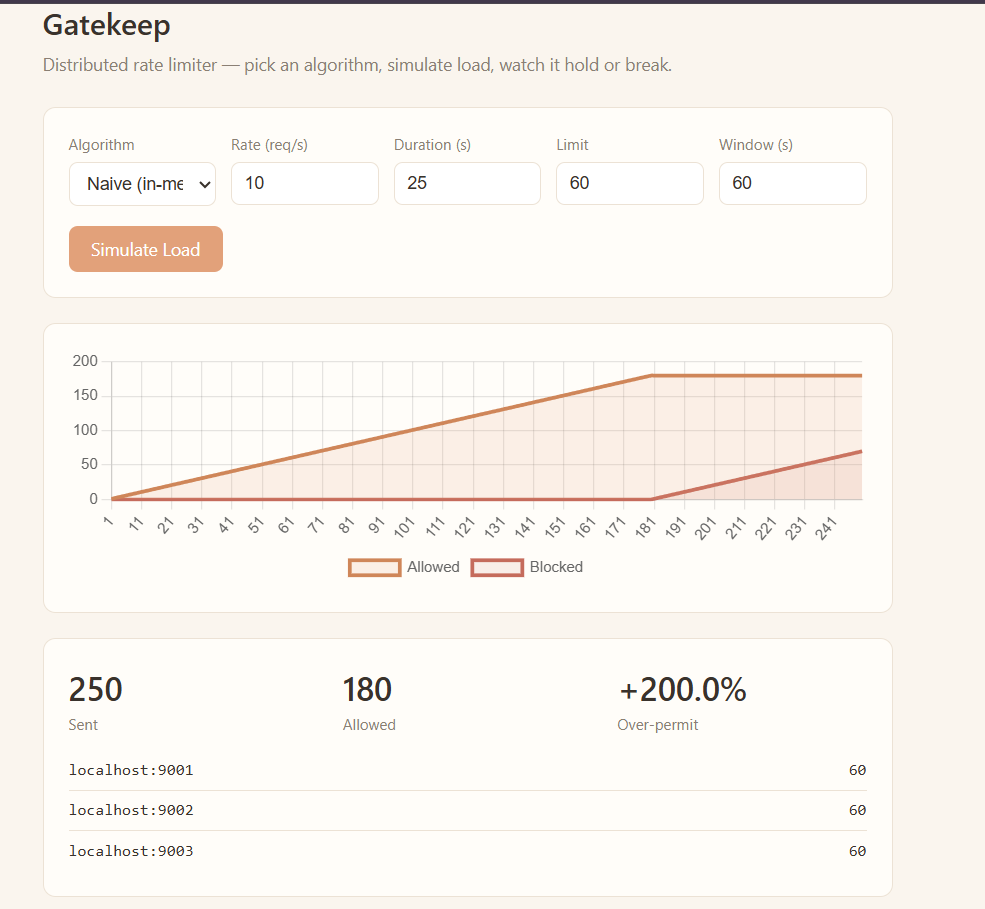

# Gatekeep

Gatekeep is a rate limiter that keeps working correctly even when your app is running on more than one server.

Most simple rate limiters count requests in the memory of a single process. That works fine on one server, but real apps usually run several copies behind a load balancer. Each copy would then keep its own count, so the same person could send far more requests than the limit allows just by landing on a different server each time. This project builds a rate limiter that avoids that problem, and proves it with real tests instead of just claiming it works.

## What it does

Gatekeep runs as a small web service with four rate limiting algorithms. One is a naive in memory version that has the bug described above. The other three, token bucket, sliding window log, and sliding window counter, store their state in Redis, so every server shares the same counts no matter how many copies are running.

There is also a small dashboard where you can pick an algorithm, send a burst of test traffic to three servers at once, and watch in real time how many requests get allowed and how many get blocked.

## Why

The goal was to prove, with real numbers and load tests, that a naive rate limiter breaks once you scale to more than one server, and that a properly shared one does not. The results of these load tests are included in the repo.

## Tech used

Python, FastAPI, Redis, Lua, Docker, pytest, HTML, CSS, JavaScript

## Running it

```
docker compose up --build -d
```

Then open `http://localhost:9001` in your browser.

## Screenshot

